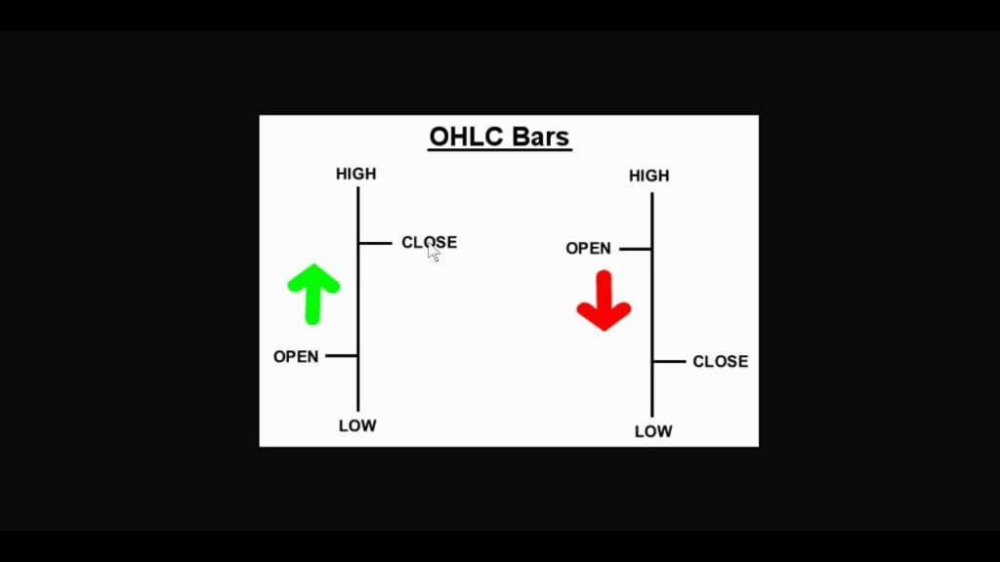

# hiekin-ashi

**Heikin-Ashi 기반 시계열 분류 — BiGRU + Attention**

---

## 1. 개요

**Heikin-Ashi** 는 일반 OHLC와 달리 시가/종가를 이전 봉과 평균 내어 캔들을 다시 그리는 방식으로, 일봉의 노이즈를 줄이고 추세를 읽기 쉽게 만드는 기법이다. 본 프로젝트는 이 Heikin-Ashi 캔들과 기술적 지표, 보조 시계열을 묶어 **다음 봉 방향(상승/하락)** 을 이진 분류하는 파이프라인이다. S&P500(SPY), NASDAQ100(QQQ) 등 대표 지수를 중심으로 데이터, 전처리, 모델, 실험을 한 저장소에서 맞춰 두었다.

기획부터 실험까지 단독으로 진행했으며, 피처만 늘리는 접근에서 벗어나 도메인/데이터 검증/시계열 누수 관리의 순서를 익히는 데 초점을 둔 개인 프로젝트다.

**Heikin-Ashi 계산식**

<p align="center">
  
</p>

```
HA_Close = (Open + High + Low + Close) / 4
HA_Open  = (전봉 HA_Open + 전봉 HA_Close) / 2
HA_High  = max(High, HA_Open, HA_Close)
HA_Low   = min(Low,  HA_Open, HA_Close)
```

### 문제 인식

초기에는 여러 지수와 개별 종목을 넓게 모아 학습했으나 타깃 및 피처 정의가 흔들려 학습이 안정적이지 않았다. 범위를 **SPY와 QQQ 등 대표 지수** 로 좁힌 뒤에야 실험이 정리되었다.

### 방향

- 대표 지수 중심으로 학습 단위를 고정한다.
- Heikin-Ashi와 기술적 지표를 조합해 입력을 구성한다.
- 날짜 기준 Train / Validation / Test로 시계열 누수를 피한다.

### 요약

`yfinance`로 OHLCV를 받아 CSV에 저장하고, SPY 기준 HA 변환, `ta` 지표/VIXY/TLT/GLD 등 피처를 만든 뒤 BiGRU+Attention으로 분류한다. 하이퍼파라미터는 Optuna로 탐색한다.

### 피처 목록

| 분류 | 피처명 | 설명 |
|------|--------|------|
| 대상 자산 (HA) | SPY_HA_O/H/L/C | 노이즈를 제거하여 추세 가독성을 높인 Heikin-Ashi 가격 데이터 |
| 모멘텀 (Momentum) | momentum_rsi | HA 종가 기준 14일 상대강도지수 (RSI) |
| 추세 (Trend) | trend_macd_diff | MACD 라인과 시그널 라인의 차이 (추세 반전 강도 측정) |
| 변동성 (Volatility) | volatility_bbh/l | HA 종가 기준 볼린저 밴드(Bollinger Bands) 상/하단 |
| 보조 지표 (VIXY) | VIXY_change/ma5 | 시장 변동성 지수(공포 지수)의 일일 등락률 및 5일 이동평균 |
| 보조 지표 (TLT) | TLT_change/ma5 | 20년물 장기 국채 수익률의 일일 등락률 및 5일 이동평균 |
| 보조 지표 (GLD) | GLD_change/ma5 | 금 가격의 일일 등락률 및 5일 이동평균 (인플레이션/헤지 지표) |
| 시장 강도 (Ratio) | SPY_TLT_ratio | 주식(SPY) 대비 채권(TLT) 가격 비율 (위험자산 선호도 반영) |

---

## 2. 기술 스택

| 구분 | 기술 |
|------|------|
| 시계열/데이터 | Python, pandas, NumPy, yfinance, YAML |
| 모델/학습 | PyTorch, BiGRU, Attention, scikit-learn, Optuna |
| 지표/특성 | `ta` (RSI, MACD, 볼린저 등) |

---

## 3. 시스템 파이프라인

1. 티커별 OHLCV 다운로드
2. Heikin-Ashi 변환 및 기술적 지표, 보조 티커 피처 결합
3. 다음 봉 HA 종가 vs 시가 기준 이진 라벨
4. 날짜로 구간 분할 후 시퀀스 윈도우/정규화/학습
5. Optuna로 검증 F1 기준 튜닝

### End-to-End 흐름

<p align="center">
  
</p>

---

## 4. 엔지니어링 포인트

### 4.1. 클래스 불균형 대응 및 Loss 가중치 최적화

**문제:** 시장 상황에 따라 상승/하락 빈도가 비대칭적으로 나타나 모델이 다수 클래스로 편향될 위험이 있습니다.

**해결:** `compute_class_weight('balanced')`를 통해 각 클래스 비율의 역수를 계산하여 Weighted CrossEntropyLoss를 적용합니다.

**구현:** 학습 데이터 내 샘플 수에 반비례하는 가중치를 Loss 함수에 주입하여, 소수 클래스(급등락 등) 예측에 대한 패널티를 강화함으로써 모델의 공정성을 확보했습니다.

### 4.2. Heikin-Ashi 기반 노이즈 제거 및 지표 안정화

**문제:** 일반 OHLCV 데이터는 시장의 미세한 노이즈가 많아 기술적 지표의 골든/데드 크로스 신호가 빈번하게 왜곡됩니다.

**해결:** 원본 가격 계열을 Heikin-Ashi 캔들로 변환한 후, 이를 기반으로 `ta` 라이브러리의 지표(RSI, MACD 등)를 산출합니다.

**효과:** 가격 smoothing 효과를 통해 지표의 추세 지속성을 높였으며, 딥러닝 모델이 보다 명확한 방향성 패턴을 학습할 수 있는 환경을 조성했습니다.

### 4.3. 거시 환경 맥락을 반영한 Intermarket 피처 설계

**문제:** 단일 자산(SPY)의 시세 데이터만으로는 금리 변동이나 시장 공포 지수 등 외부 충격 요인을 반영하기 어렵습니다.

**해결:** VIXY(변동성), TLT(20년물 국채), GLD(금)의 수익률 및 5일 이동평균 변화율을 보조 시계열로 결합합니다.

**핵심 지표:** `SPY_TLT_ratio`를 통해 주식과 채권 간의 자금 흐름(Relative Strength)을 수치화하여 모델에 거시적 마켓 타이밍 정보를 전달합니다.

### 4.4. Optuna를 활용한 하이퍼파라미터 자동 최적화

**문제:** LSTM/Transformer 구조 내의 Hidden size, Dropout 등 다수의 파라미터를 수동으로 조정하는 것은 비효율적이며 국소 최적해(Local Optima)에 빠질 우려가 있습니다.

**해결:** Optuna Framework를 도입하여 50회의 Trial 동안 4개 핵심 파라미터를 동시에 탐색합니다.

**목적 함수:** 단순 정확도 대신 클래스 불균형을 고려한 Weighted F1-score를 검증 지표로 설정하여 예측의 정밀도(Precision)와 재현율(Recall)을 균형 있게 최적화했습니다.

### 4.5. 시계열 데이터 누수(Data Leakage) 원천 차단

**문제:** 시계열 데이터 학습 시 미래 정보가 학습셋에 포함되는 Look-ahead bias는 백테스트 성과를 왜곡하는 치명적인 원인이 됩니다.

**해결:** Chronological Split을 적용하고, 윈도우 시퀀스(Window Sequence) 생성 시 각 데이터셋(Train/Val/Test)의 경계를 넘지 않도록 구간 내 제한을 두었습니다.

**검증:** 학습 시점 기준 이전 데이터만 참조하도록 파이프라인을 엄격히 분리하여 모델의 실전 전개 시 일반화 성능을 보장합니다.

---

## 5. 팀

| 이름 |
|------|
| jsm0308 (개인 프로젝트) |
