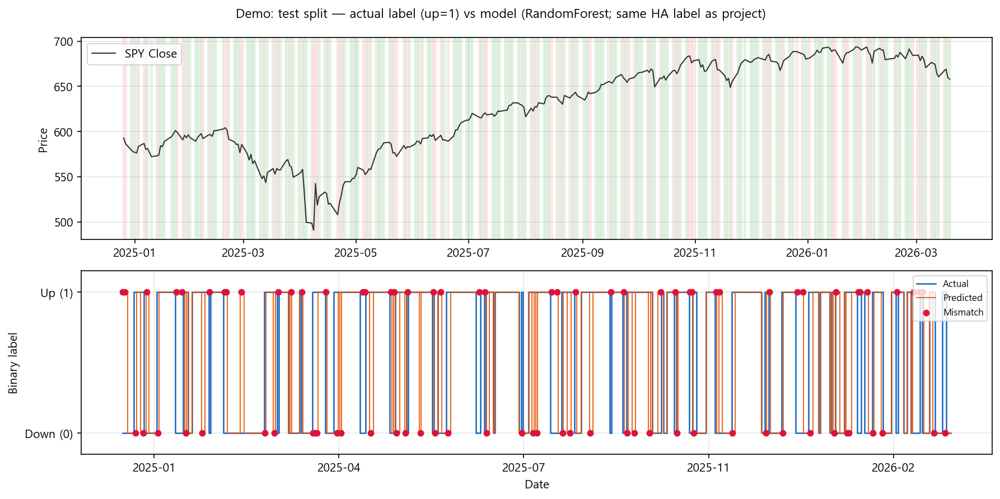

# hiekin-ashi

**Heikin-Ashi 기반 시계열 분류 — BiGRU + Attention**

---

## 1. 개요

**Heikin-Ashi(平均足)** 는 일반 OHLC와 달리 시가·종가를 이전 봉과 평균 내어 캔들을 다시 그리는 방식으로, 일봉의 노이즈를 줄이고 추세를 읽기 쉽게 만드는 표현이다. 본 프로젝트는 이 Heikin-Ashi 캔들과 기술적 지표·보조 시계열을 묶어 **다음 봉 방향(상승/하락)** 을 이진 분류하는 파이프라인이다. S&P500(SPY)·NASDAQ100(QQQ) 등 대표 지수를 중심으로 데이터·전처리·모델·실험을 한 저장소에서 맞춰 두었다.

기획부터 실험까지 단독으로 진행했으며, 피처만 늘리는 접근에서 벗어나 도메인·데이터 검증·시계열 누수 관리의 순서를 익히는 데 초점을 둔 개인 프로젝트다.

### 문제 인식

초기에는 여러 지수·개별 종목을 넓게 모아 학습했으나 타깃·피처 정의가 흔들려 학습이 안정적이지 않았다. 범위를 **SPY·QQQ 등 대표 지수** 로 좁힌 뒤에야 실험이 정리되었다.

### 방향

- 대표 지수 중심으로 학습 단위를 고정한다.
- Heikin-Ashi와 기술적 지표를 조합해 입력을 구성한다.
- 날짜 기준 Train / Validation / Test로 시계열 누수를 피한다.

### 요약

`yfinance`로 OHLCV를 받아 CSV에 저장하고, SPY 기준 HA 변환·`ta` 지표·VIXY·TLT·GLD 등 피처를 만든 뒤 BiGRU+Attention으로 분류한다. 하이퍼파라미터는 Optuna로 탐색한다.

---

## 2. 기술 스택

| 구분 | 기술 |
|------|------|
| 시계열·데이터 | Python, pandas, NumPy, yfinance, YAML |
| 모델·학습 | PyTorch, BiGRU, Attention, scikit-learn, Optuna |
| 지표·특성 | `ta` (RSI·MACD·볼린저 등) |

---

## 3. 시스템 파이프라인

1. 티커별 OHLCV 다운로드 → `data/raw/` CSV
2. Heikin-Ashi 변환 및 기술적 지표, 보조 티커 피처 결합
3. 다음 봉 HA 종가 vs 시가 기준 이진 라벨
4. 날짜로 구간 분할 후 시퀀스 윈도우·정규화·학습 (`src/train.py`)
5. Optuna로 검증 F1 기준 튜닝 (`src/optimize.py`)

### End-to-End 흐름

Figma로 그릴 **전체 도식** 은 아래 대화에 정리한 블록과 화살표를 참고하면 된다. 내보낸 PNG는 `docs/pipeline.png` 등으로 두고 아래처럼 넣을 수 있다.

<p align="center">
  
</p>

> 위 그림은 **BiGRU가 아닌** 데모용 RandomForest로, 프로젝트와 **동일한 HA 라벨 정의** 만 맞춘 예측·실제 비교다. 학습된 신경망 추론 곡선으로 바꾸려면 평가 스크립트에서 저장한 `Date`, `Label`, `pred` 컬럼을 넣어 같은 형식으로 그리면 된다.

---

## 4. 엔지니어링 포인트

### 4.1. 데이터 소스

- `yfinance`는 Yahoo Finance 비공식 경로에 의존한다. 장기 운용 시 소스 교체·검증이 필요할 수 있다.
- **새 데이터가 필요하면** 아래 [데이터 요청 시](#데이터-요청-시-제공해-주실-것) 을 채워 요청해 달라. 저장소에 없는 형식·유료 피드는 사용자가 파일을 주시면 파이프라인에 맞게 연결하는 방향이 안전하다.

### 4.2. 시계열 누수 방지

- `training.train_end_date`, `validation_end_date`로 구간을 자르고, 윈도우는 구간 안에서만 만든다.

### 4.3. 설정

- `configs/config.yaml` 한 파일에서 데이터·모델·경로를 관리한다.

---

## 데이터 요청 시 제공해 주실 것

아래를 알려주시면, 필요한 경우 그에 맞춰 전처리 스키마나 import 스크립트를 제안하겠다.

| 항목 | 설명 |
|------|------|
| **형식** | CSV 권장. 컬럼명·날짜 형식(예: `YYYY-MM-DD`), 타임존(일봉이면 거래일 기준). |
| **최소 컬럼** | 일봉이면 `Date`, `Open`, `High`, `Low`, `Close`, `Volume`(없으면 명시). |
| **피처** | 이미 계산된 지표가 있으면 컬럼명과 의미(예: RSI 14일). 없으면 원천 OHLCV만으로도 가능하다. |
| **데이터 소스** | 예: 브로커 API, 유료 벤더, 직접 크롤링 허용 여부·이용약관. |

**지금 당장 추가 파일이 없으면** `configs/config.yaml`의 `start_date` / `end_date`만 조정한 뒤 `python src/1_data_download.py`로 갱신하는 흐름을 쓰면 된다.

---

## 5. 실행 방법

```bash
pip install -r requirements.txt

python src/1_data_download.py
python src/2_feature_engineering.py
python src/train.py
python src/optimize.py
```

예측·실제 비교 **데모 이미지** 재생성:

```bash
pip install pandas numpy yfinance matplotlib scikit-learn
python scripts/plot_prediction_vs_actual_demo.py
```

출력: `docs/figures/prediction_vs_actual_demo.png`

---

## 6. 팀

| 이름 |
|------|
| jsm0308 (개인 프로젝트) |
