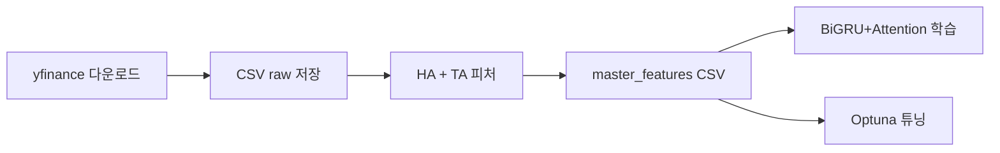

# hiekin-ashi

**Heikin-Ashi 기반 BiGRU + Attention 시계열 분류 (SPY·QQQ 중심)**

---

## 1. 개요 (Summary)

이 프로젝트는 Heikin-Ashi 캔들 구조를 기반으로 S&P500(SPY), NASDAQ100(QQQ) 등 대표 시장 지수를 학습해 다음 봉 방향(상승/하락)을 예측하는 딥러닝 파이프라인이다. 데이터 수집·전처리·피처 생성·모델·하이퍼파라미터 탐색까지 한 저장소에서 재현할 수 있도록 구성했다.

기획·데이터·모델·실험 전 과정을 단독으로 수행했으며, “피처를 많이 넣으면 된다”는 가정에서 벗어나 도메인·데이터 검증·파이프라인 이해의 순서를 체득하는 데 초점을 둔 개인 프로젝트다.

### 배경 · 문제 인식

초기에는 여러 지수·개별 종목을 무작위로 수집해 학습했으나, 피처와 타깃 선정이 불명확해 모델이 안정적으로 학습하지 못했다. “데이터가 많다고 문제가 풀리지는 않는다”는 점을 체감한 뒤, 외생 변수 영향이 큰 개별 종목 대신 시장 전체 흐름을 반영하는 **SPY·QQQ** 중심으로 범위를 좁혔고, 그 이후부터 의미 있는 학습 곡선을 확인할 수 있었다.

### 본 프로젝트의 방향

- **대표 지수 중심**: 학습·실험 단위를 SPY/QQQ 등으로 고정해 노이즈와 스코프를 관리한다.
- **Heikin-Ashi + 기술적 지표**: 캔들 스무딩과 RSI·MACD·볼린저 등 조합으로 입력 피처를 구성한다.
- **시계열 분할·검증**: 날짜 기준 Train / Validation / Test로 누수를 피한다.

### 모델·시스템 요약

- **원천 데이터**: `yfinance`로 OHLCV 수집 후 CSV로 저장 (`configs/config.yaml`의 기간·티커 설정).
- **피처**: SPY 기준 Heikin-Ashi 변환, `ta` 기반 지표, VIXY·TLT·GLD 등 보조 시계열 변화율·비율 피처.
- **모델**: 양방향 GRU + Attention + 분류 헤드 (`src/model.py`).
- **튜닝**: Optuna로 검증 F1 기준 하이퍼파라미터 탐색 (`src/optimize.py`).

---

## 2. 기술 스택 (Tech Stack)

| 구분 | 기술 |
|------|------|
| **Vision & AI** | — (본 프로젝트는 금융 시계열; 이미지/Vision 미사용) |
| **Backend / Infra** | Python 3, YAML 설정 |
| **Model** | PyTorch, BiGRU + Attention, Optuna |
| **기타** | pandas, NumPy, scikit-learn, yfinance, `ta` |

---

## 3. 시스템 파이프라인 (System Pipeline)

1. **데이터 다운로드**: `yfinance`로 티커별 OHLCV를 `data/raw/`에 저장.
2. **Heikin-Ashi·지표**: SPY 기준 HA 캔들 및 기술적 지표, 보조 티커 피처 결합.
3. **라벨링**: 다음 봉 Heikin-Ashi 종가 vs 시가 기준 이진 라벨.
4. **학습·검증**: 시계열 분할 후 시퀀스 윈도우·정규화·DataLoader 구성 (`src/train.py`).
5. **하이퍼파라미터 탐색**: Optuna로 학습률·은닉 크기·드롭아웃 등 탐색 (`src/optimize.py`).

### End-to-End 흐름 (Mermaid)



> 정적 다이어그램을 쓰려면 Figma 등에서 내본 이미지를 `docs/pipeline.png` 등으로 두고 README에 삽입하면 된다.

---

## 4. 주요 엔지니어링 포인트 (Engineering Points)

### 4.1. 데이터 소스와 재수집

- **문제:** 과거에는 일부 소스에서 크롤링/API가 불안정하거나 제한되는 경우가 있었다.
- **해결:** 현재 파이프라인은 **Yahoo Finance를 경유하는 `yfinance`**로 일별 OHLCV를 받아온다. 재현을 위해 기간·티커는 `configs/config.yaml`에서 관리한다.
- **구현:** `src/1_data_download.py`, `configs/config.yaml` (`data.start_date`, `data.end_date`, `data.tickers`).

### 4.2. 시계열 누수 방지

- **문제:** 무작위 셔플·미래 정보 혼입은 금융 시계열에서 치명적이다.
- **해결:** `training.train_end_date`, `validation_end_date`로 구간을 나누고, 윈도우 시퀀스는 각 구간 내에서만 생성한다.

### 4.3. 설정 단일화

- **문제:** 설정 파일이 중복·깨지면 실험이 재현되지 않는다.
- **해결:** `configs/config.yaml` 한 곳에서 데이터·모델·학습·출력 경로를 정의하고, 스크립트는 프로젝트 루트 기준으로 이 파일을 읽는다.

---

## 5. 실행 방법

저장소 루트에서 실행한다 (`python` 경로에 프로젝트 루트가 잡히도록).

```bash
python -m venv .venv
# Windows: .venv\Scripts\activate
# macOS/Linux: source .venv/bin/activate

pip install -r requirements.txt

python src/1_data_download.py
python src/2_feature_engineering.py
python src/train.py
python src/optimize.py
```

- **설정 변경**: `configs/config.yaml`에서 `data.end_date`를 오늘에 가깝게 올리면 **최신 구간까지 다시 내려받기**가 가능하다. 학습 구간 분할(`train_end_date` 등)도 새 데이터에 맞게 조정하는 것이 좋다.
- **피처 산출물**: `data.processed_path` 아래 `master_file`(기본 `master_features_SPY.csv`)에 저장된다. Optuna는 `master_features_{optimization_target}.csv`를 읽는다.

---

## 6. 데모 (Demo)

| 항목 | 경로 |
|------|------|
| 원시 시계열 (다운로드 후) | `data/raw/` |
| 가공 피처 | `data/processed/` (설정의 `master_file`) |
| 실험 로그·요약 (기존 산출물) | `output/` |

---

## 7. Acknowledgements

- 시세 데이터: [yfinance](https://github.com/ranaroussi/yfinance) (Yahoo Finance 비공식 API)
- 딥러닝: [PyTorch](https://pytorch.org/)
- 하이퍼파라미터 탐색: [Optuna](https://optuna.org/)
- 기술적 지표: [ta](https://github.com/bukosabino/ta)

---

## 8. Team

| Name |
|------|
| jsm0308 (개인 프로젝트) |
