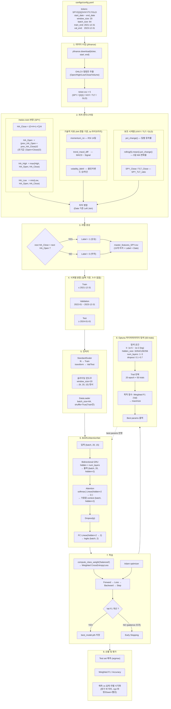

# Pipeline Diagram

```mermaid
flowchart TB
  %% ── 1. 설정 ──────────────────────────────────────────
  subgraph cfg["configs/config.yaml"]
    direction LR
    C1["tickers: SPY/QQQ/VIXY/TLT/GLD\nstart_date ~ end_date\nwindow_size: 20\nbatch_size: 64\ntrain_end: 2021-12-31\nval_end:   2023-12-31"]
  end

  %% ── 2. 수집 ──────────────────────────────────────────
  subgraph ingest["1. 데이터 수집 (yfinance)"]
    direction TB
    I1["yfinance.download(ticker, start, end)"] --> I2["OHLCV 컬럼만 추출\n(Open/High/Low/Close/Volume)"]
    I2 --> I3["ticker.csv × 5\n(SPY / QQQ / VIXY / TLT / GLD)"]
  end

  %% ── 3. 피처 ──────────────────────────────────────────
  subgraph feat["2. 피처 엔지니어링"]
    direction TB

    subgraph ha["Heikin-Ashi 변환 (SPY)"]
      H1["HA_Close = (O+H+L+C)/4"]
      H2["HA_Open  = (prev_HA_Open + prev_HA_Close)/2\n(초기값: (Open+Close)/2)"]
      H3["HA_High  = max(High, HA_Open, HA_Close)"]
      H4["HA_Low   = min(Low,  HA_Open, HA_Close)"]
    end

    subgraph ta_feat["기술적 지표 (HA 캔들 기준, ta 라이브러리)"]
      T1["momentum_rsi       — RSI 14일"]
      T2["trend_macd_diff    — MACD − Signal"]
      T3["volatility_bbh/l  — 볼린저밴드 상/하단"]
    end

    subgraph aux["보조 시계열 (VIXY / TLT / GLD)"]
      A1["pct_change()        — 일별 등락률"]
      A2["rolling(5).mean().pct_change() — 5일 MA 변화율"]
      A3["SPY_Close / TLT_Close — SPY_TLT_ratio"]
    end

    ha --> merge["피처 병합\n(Date 기준 Left Join)"]
    ta_feat --> merge
    aux --> merge
  end

  %% ── 4. 라벨 ──────────────────────────────────────────
  subgraph label["3. 라벨 생성"]
    L1{"next HA_Close > next HA_Open ?"}
    L1 -->|"YES"| L2["Label = 1  (상승)"]
    L1 -->|"NO"| L3["Label = 0  (하락)"]
    L2 --> L4["master_features_SPY.csv\n(15개 피처 + Label + Date)"]
    L3 --> L4
  end

  %% ── 5. 분할 ──────────────────────────────────────────
  subgraph split["4. 시계열 분할 (날짜 기준, 누수 없음)"]
    direction LR
    S1["Train\n≤ 2021-12-31"]
    S2["Validation\n2022-01 ~ 2023-12-31"]
    S3["Test\n≥ 2024-01-01"]
  end

  %% ── 6. 전처리 ─────────────────────────────────────────
  subgraph prep["5. 전처리"]
    P1["StandardScaler\nfit → Train\ntransform → Val/Test"]
    P2["슬라이딩 윈도우\nwindow_size=20\n→ (N, 20, 15) 텐서"]
    P3["DataLoader\nbatch_size=64, shuffle=True(Train만)"]
  end

  %% ── 7. 모델 ──────────────────────────────────────────
  subgraph model["6. BiGRUAttentionNet"]
    direction TB
    M1["입력  (batch, 20, 15)"]
    M2["Bidirectional GRU\nhidden × num_layers\n→ 출력 (batch, 20, hidden×2)"]
    M3["Attention\nsoftmax( Linear(hidden×2 → 1) )\n→ 가중합 context (batch, hidden×2)"]
    M4["Dropout(p)"]
    M5["FC Linear(hidden×2 → 2)\n→ logits (batch, 2)"]
    M1 --> M2 --> M3 --> M4 --> M5
  end

  %% ── 8. 학습 ──────────────────────────────────────────
  subgraph train["7. 학습"]
    direction TB
    TR1["compute_class_weight('balanced')\n→ Weighted CrossEntropyLoss"]
    TR2["Adam optimizer"]
    TR3["Forward → Loss → Backward → Step"]
    TR4{"Val F1 개선 ?"}
    TR4 -->|"YES"| TR5["best_model.pth 저장"]
    TR4 -->|"NO (patience 초과)"| TR6["Early Stopping"]
    TR1 --> TR3
    TR2 --> TR3
    TR3 --> TR4
  end

  %% ── 9. 튜닝 ──────────────────────────────────────────
  subgraph tune["8. Optuna 하이퍼파라미터 탐색 (50 trials)"]
    direction TB
    O1["탐색 공간\nlr: 1e-5 ~ 1e-2 (log)\nhidden_size: 32/64/128/256\nnum_layers: 1~3\ndropout: 0.1~0.7"]
    O2["Trial 반복\n20 epoch × 50 trials"]
    O3["목적 함수: Weighted F1 (Val)\n→ maximize"]
    O4["Best params 출력"]
    O1 --> O2 --> O3 --> O4
  end

  %% ── 10. 산출 ─────────────────────────────────────────
  subgraph out["9. 산출 및 평가"]
    R1["Test set 예측 (argmax)"]
    R2["Weighted F1 / Accuracy"]
    R3["예측 vs 실제 라벨 시각화\n(종가 바 차트, Up=파랑/Down=빨강)"]
  end

  %% ── 연결 ─────────────────────────────────────────────
  cfg --> ingest
  ingest --> feat
  feat --> label
  label --> split
  split --> prep
  prep --> model
  model --> train
  train --> tune
  train --> out
  tune -.->|"best params 반영"| model
```
